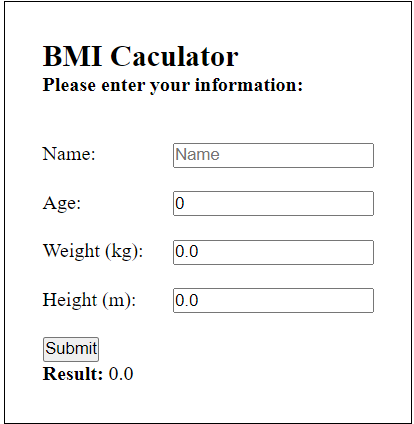
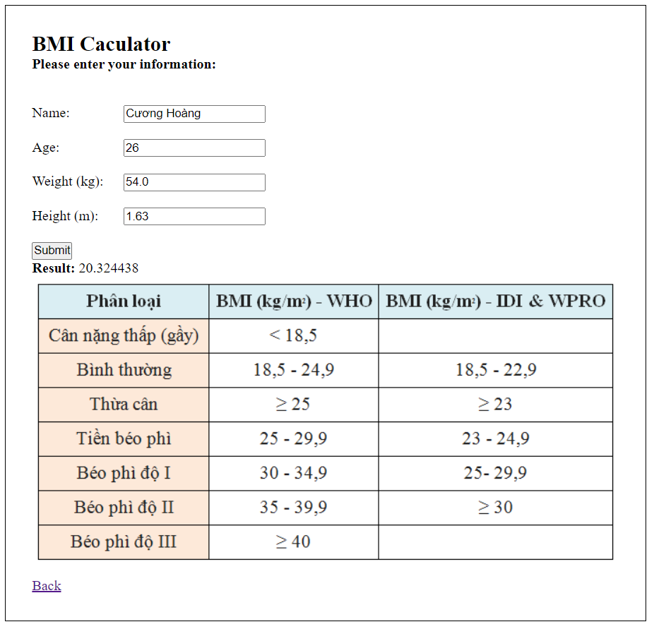

#Tính Body Mass Index

Project nhằm mục đích xử lý submit form.

##1. Cấu trúc
   
- Ba phần chính:
    + Controller: xử lý request - 1 file duy nhất
    + Model: Xây dựng BMI làm model chính và BMIRequest để nhận thông tin từ form
    + Service: tính toán BMI index;
- View: xây dựng 1 view duy nhất là home.html ở folder templates
    
##2. Chi tiết project 
   
Project để mặc định chạy ở http://localhost:8080. Sau khi tiếp nhận submit sẽ trả về kết quả tại http://localhost:8080/result.

###2.1. Load form

- Sử dụng thyme leaf để render và lấy dữ liệu từ form. 
- Controller bắt request load form tại  http://localhost:8080 sau đó trả về 1 BMIRequest rỗng để render.

###2.2. Submit form

- Controller binding dữ liệu với BMIRequest và xử lý truyển dữ liệu vào một BMI.
- Gọi BMIServiceImpl tính toán bmiIndex, trả về model BMI hoàn chỉnh và trả về view.
- Nhằm tối ưu trải nghiệm người dùng, sử dụng BMIRequest để render lại thông tin của người sử dụng, nếu result không phải là null thì sẽ render ra ảnh phân loại và nút back.

##3. Lưu ý
- Cấu trúc vẫn thể hiện sự phụ thuộc của service vào BMI. Để giải quyết thì ta có thể tạo 1 Interface là Index và để BMI implements Index. Trong service sẽ dùng Index để giảm sự phụ thuộc.
- Đã tạo thêm lớp BMIMapper để covert từ BMIRequest sang BMI;