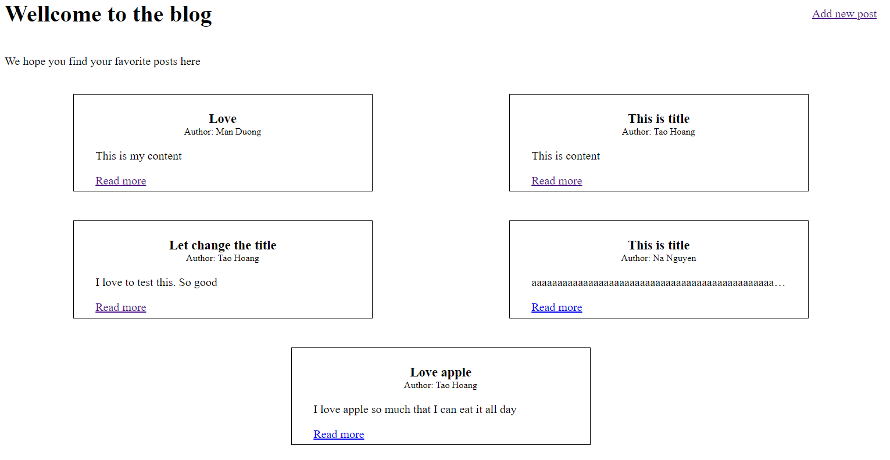
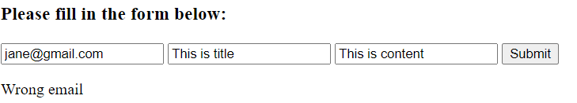
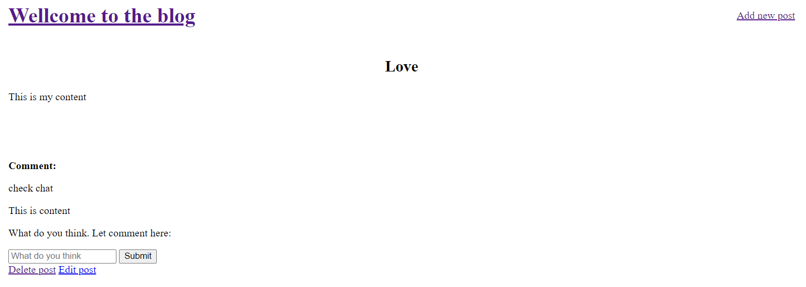

#Trang blog chia sẻ bài viết

Mục tiêu của project nhằm thực hiện một số thao tác cơ bản với CSDL MySQL.

##1.Tổng quan

Project sẽ có trang chủ hiển thị tất cả các bài viết. Tại đây ta có thể view chi tiết bài viết và tạo bài viết mới

Để tạo bài viết email sẽ bắt buộc thuộc email đã được cấu hình sẵn trong database. Nếu sai sẽ báo lỗi, đúng sẽ quay về trang chủ.

Bên trong post ta có thể thực hiện comment, edit hoặc xóa bài viết.

##2.Chi tiết

###2.1 Cấu hình kết nối với mySQL
    spring.datasource.url=jdbc:mysql://localhost:3306/*điền tên schema*?createDatabaseIfNotExist=true&useJDBCCompliantTimezoneShift=true&useLegacyDatetimeCode=false&serverTimezone=UTC
    spring.datasource.username=*điền username*
    spring.datasource.password=*điền password*

###2.2 Các model sử dụng
- 3 entity: User, Post, Comment
- 2 model phụ: PostRequest và CommentDTO dùng để bắt dữ liệu từ form và truyền lại dữ liệu đó vào entity.

###2.3 Repository và service
Repository extend JpaRepository để có thể dùng các chức năng như 1 ứng dụng CRUD. Service đơn giản gọi repo, không xử lý gì phức tạp

###2.4 Controller
Controller sử dụng nhiều @PathVariable để thuận tiện cho việc lấy dũ liệu từ link.
- HomeController: bắt request và view trang chủ tại http://localhost:8080/
- CommentController: xử lý post quest lưu comment
- PostController: xử lý các request liên quan đến thêm, sửa, xóa.

##3.Lưu ý
Bài thực hành chưa có đăng nhập nên việc tạo email để đăng bài là chưa cần thiết. Có thể bỏ User các phần liên quan. Nếu để thì hãy tạo một vài email sẵn trong database để có thể up post.

Chưa biết việc sử dụng lấy dữ liệu từ đường đãn có ảnh hưởng nhiều đến bảo mật hay không.